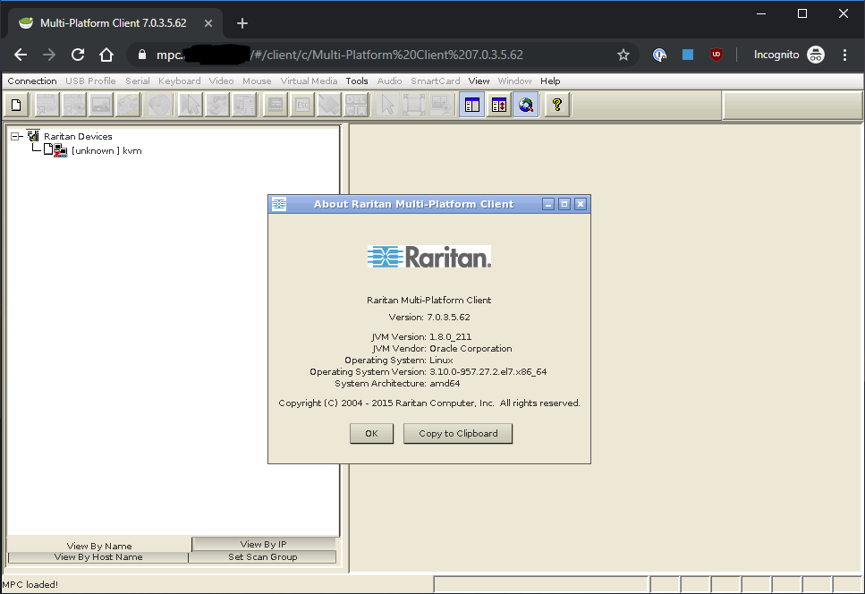

# raritan-mpc
The old Raritan KVM switches use unsigned applets in the web based java application.  Raritan has addressed this by creating a Multi-Platform client that can use an old version of Java installed on your machine.  This does not however fix the web interface.  The solution presented here is to run the apprioriate java environment in a docker container and export the session via an HTML5 interface and a remote desktop session. This will removes all client requirements and allows the app to be accessed from a chromebook with no required extensions. 

# Java issues
The version of java in the base image does not render the application correctly.  Neither does OpenJDK.  
Included in the package is a hack to get the offical Java into the image.  Oracle has made it impossible to build an image that includes a download of the official JRE or JDK.  What I do here to solve the prorblem is run the offical JRE8 from Oracle on docker hub and make it output a tar of the /usr/java/latest directory.  You will need to have a docker hub account, purchase the free JRE8 by accepting the license, log your docker instance into your docker hub account and run the create script in this package.

# Security
There is none.  I personally use jwilder/docker-gen to publish the app to a hostname and secure it with client certificates.

# Login screen

# Application screen

# License
This package is MIT.
Binaries for Raritan MPC and Java JRE are not included in this package and are licensed by their respective owners.
